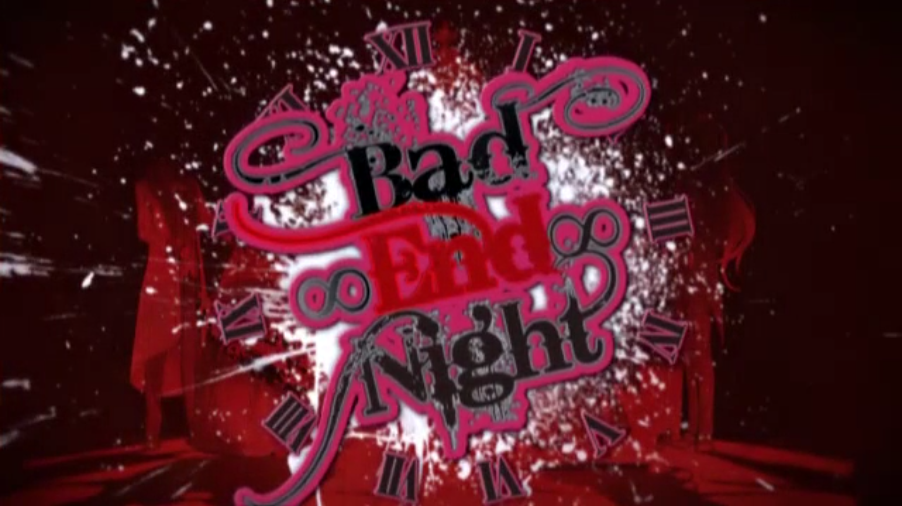

# 呼嘎，这里是李新朋。

## 首先是vocaloid周刊介绍

### 〘V榜〙

1. 【初音ミク】Last Dance【Eve】 av38145487
2. 【初音ミク】这首歌如果播放不过100万我就去死！【たまお】 av18905926
3. 【初音ミク】无论何时HappyDay！【バカッパの証】 av7148145
4. 【GUMI】马赛克卷【DECO27】 av6397355
5. 【初音ミク】暴力扳机【八王子P】 av38847372 （new！）
6. 【初音ミク】发条少女时钟【Drop】 av37788594
7. 【鏡音リン】ROKI【みきとP】 av20149916
8. 【初音ミク&鏡音レン】Crazy・Beat【さつき が てんこもり】 av38065639
9. 【初音ミク】Dance Robot Dance【ナユタン星人】 av7411554
10. 【VY1&初音ミク】心灵・死亡【砂天狗】 av38525434 （new！）
11. 【KAITO】欢迎来到 大 三元 乐园！【nyanyannya】 av36822467
12. 【初音ミク】砂之行星【ハチ】【魔法未来2017主题曲】 av12428430
13. 【歌愛ユキ】浮遊月光街【稲葉曇】 av38760155 （new！）
14. 【初音ミク】幽灵法则【DECO27】 av3540151
15. 【初音ミク】绿光·小夜曲【Omoi】【2018魔法未来主题曲】 av26278906
16. 【鏡音リン&鏡音レン】劣等上等【ギガ】【魔法未来2018 / 鏡音レン・リン 10th周年主题曲】 av26776777
17. 【初音ミク】Alien Alien【ナユタン星人】 av4285714
18. 【紲星あかり】Akari来了哦【GYARI（ココアシガレットP）】 av32209798
19. 【初音ミク】I love U【ううめ】 av12044093
20. 【初音ミク】追想阳歌【40mP】 av38382874 （new！）
21. 【鏡音レン】拼图游戏【まふまふ】 av37076516
22. 【flower】Charles【バルーン】 av6648468
23. 【Rana】Aimless walker【Luna】
24. 【初音ミク】拟剧论【Eve】 av15274543
25. 【GUMI】如果能成为谁的心脏的话【ユリイ・カノン】 av19505742
26. 【初音ミク】火花【DECO27】 av12965661
27. 【結月ゆかり】几望之月【なきゃむりゃ】 av32209965
28. 【IA】明日的夜空哨戒班【Orangestar】 av1437042
29. 【初音ミク】Unknown Mother-Goose【wowaka】 av13673279
30. 【初音ミク】碱性劣等生【かいりきベア】 av7248840

eve成功反杀，获得第一名的成绩，然而p子王八（只是戏称，并非摸黑)只能第五，因为八王子p的compass角色去发布，几乎所有compass曲上升，八王子p的那个megumegu角色曲也很好听，pv制作精良，歌曲也很好(可以电成王八了)剧情，算了，这不是我们八王子p能决定得了的，求求林p了，做个人吧，这么小的孩子，弄个这么个剧情，compass都要成孤儿院了。

可怜我megumegu了，放几张图，想看剧情的去bilibili自己看吧，剧情有些涉嫌暴力。

~~点点点，我已经把所有涉嫌暴力的部分删除了，这里是涉嫌暴力的部分，原来是三张megumegu的照片~~

第10名也是我强推的对象，砂天狗第二首曲子，很惊艳很有前途，pv也做的很赞，歌曲和roki差不多的曲风，使用的vy1也是不常用的音源，yamaha自家制造，人设是一把擅自e，其实就是没有人设，让你自己想(可能这也是没有人气的原因吧，但声音很好听)，调教的也很好，强烈推荐 。

***

今天推荐双子亲妈，一滴p，也是悲剧大师，双子必须死一个，大姐是剑士，大哥必须死系列(请注意这是必考题)，一滴p一般是和yamap一起合作，一滴p和yama一起合作是在杀戮人偶爆发([av50399](https://www.bilibili.com/video/av50399/))，然后之后就一直合作直到现在。

~~点点点，我已经把所有涉嫌暴力的部分删除了，这里是涉嫌暴力的部分，原来是一张杀戮人偶的照片~~

杀戮人偶爆发讲的是RIN的父母都被杀戮人偶所杀(此处的杀戮人偶泛指由某些科学家造出来的而非长大后的RIN)，而LEN的父母则是在LEN的面前被杀害。

RIN和LEN在孤儿院里成为好朋友，但接下来发生的事如一场噩梦般袭来，RIN被初音MIKU带走，LEN想抢回RIN却被打瞎了一只眼睛，随后len被KAITO捡走。

RIN被初音MIKU培养成了杀戮人偶，并有目的性的杀人，后来也失去了一只眼睛。

而LEN却被培养成了右旋的军官。

长大后相逢时，他们已经互为敌人，但是当真正的互相残杀时才猛然记起小时的过往。

然而他们都是被抛弃和利用的杀戮人偶罢了。

还是很好听的。

一滴p除了yama之外，也有固定画师铃之助，pv师tso和vava的3D特效让pv开始成为一滴p的黄金时期。

***

## 第一首雪系列，被成为是与恶之p的饿系列与囚人p的纸飞机系列被成为镜音三大悲剧

原曲过于老旧，这是一滴的新版，说是新版，其实也已经2012年的事了。

意思主要是rin身体不好，有一天rin在雪中玩耍时离开人世，len把给rin的思念，唱出来，然后被雪吸收，雪覆盖着一切，一切就像没有发生过一样。

这是一滴p的成名曲。

四季折之翼，一滴p在中国最火的曲子之一这可以说是日本民间故事白鹤报恩V+双子版本，年轻人(len)帮助中了陷阱的白鹤(rin)，然后与变成人类的白鹤一起组家庭，后来年轻人病倒了，白鹤用它自己的羽毛来纺织赚钱，最后羽毛最后到了最后一根，最后年轻人还是去世了，至于白鹤，原文倒没说 。

> Soundless Voice [av377901](https://www.bilibili.com/video/av377901/)

***

## 无敌烧脑爆炸史诗级巨作night系列。

剧情太大了，一共四首，如果有兴趣的去百度查一下night系列。

(我看了一个月小说才有些搞明白想知道的自己问吧。)

整体曲风一种热闹而欢快有点略疯狂，全故事围绕miku来展开，都些像音乐剧的形式，在其余7人知道剧本而miku未知展开。

pv一开始便完全精致，到最后，因为每张都不一样，之放了一个标题在上面，原pv不只是标题。

> Bad∞End∞Night [av199948](https://www.bilibili.com/video/av199948/)

> Crazy∞Night [av312154](https://www.bilibili.com/video/av312154/)

> Twilight∞Night [av471464](https://www.bilibili.com/video/av471464/)

> Ever∞Lasting∞Night [av5670969](https://www.bilibili.com/video/av5670969)

***

## 最后，8人合唱算什么10人合唱才算是nb。

祝福的救世主与爱之塔，10人合唱，4家公司，真实巨作。

这次pv没有上次一样疯狂，这次略有悲剧色彩，也没有之前一样热烈，可能还会有系列吧，但还要等三年吧。

大哥又是最早死的，真惨 。

算了，一滴什么人都知道，习惯了。

人物：

| | |
|-|-|
| KAITO大哥 | 村长 |
| MEIKO大姐 | 剑士 |
| IA | 手工匠の姉 |
| MAYU | 手工匠の妹 |
| GACKPOID茄子 | 僧侣 |
| GUMI | 诗人 |
| LUKA | 舞娘 |
| RIN橘砸 | 牧羊人中的姐姐 |
| LEN蕉 | 牧羊人中的弟弟 |
| MIKU | 女缝纫工 |

一根剧情线：

这个故事发生在一个自给自足的贫瘠土地，神灵(弥赛亚)给了这个土地9种祝福，本来这九种祝福都应该是由MIKU所接受的，但是KAITO作为村长都在接受祝福时推开了MIKU表现得十分自私地自己接受了祝福，MIKU每次进入塔内剩下人一次一次地被排挤，MIKU眼中大家是自私的不近人情的……在MIKU眼里剩下9人都接受祝福，只有自己一个人被人们排挤。

但其余9人都知道，**祝福其实是诅咒**，每个人都为了想让miku活下来，自己去接受死亡，9人在分别的折磨中死去，只是想让miku成为最终的救赎者带领人们走下去。

其余九个人都死的好惨呀，算了，不说了，涉嫌了，想看的自己去bilibili上看吧。

> 祝福的救世主与爱之塔 [av5415624](https://www.bilibili.com/video/av5415624/)

***

今天是弄不了giga了，因为一滴太多了，giga我明天说。

之后说的是jin与阳炎project。

## 最后是资讯

2019年雪初音将在1月23日发售。

*在纯白的风景中，与你描绘出10年的轨迹和今后的故事。*

收录曲:

* DISC 1

1. AI - SNOW MIKU 2019 Theme song / DECO\*27 feat. Hatsune Miku
2. Round off the Square Earth - SNOW MIKU 2018 Theme song / TOKOTOKO(NishizawasanP) feat. Hatsune Miku
3. Star Night Snow - SNOW MIKU 2017 Theme song / n-buna × Orangestar feat. Hatsune Miku
4. Before the Snow Melts - SNOW MIKU 2016 Theme song / doriko feat. Hatsune Miku
5. Snow Fairy Story - SNOW MIKU 2015 Theme song / 40mP feat. Hatsune Miku
6. Suki! Yuki! Maji Magic - SNOW MIKU 2014 Theme song / Mitchie M feat. Hatsune Miku
7. SNOW GLITTER - SNOW MIKU 2013 official song / electro sonar feat. Hatsune Miku
8. Yukisora - SNOW MIKU Sky Town 2nd Anniversary Fluffy Coat Thene song / toa feat. Hatsune Miku
9. White & Sweet - SNOW MIKU Sky Town 2nd Anniversary Fluffy Coat Thene song / LamazeP feat. Hatsune Miku
10. stella - SNOW MIKU Sky Town Theme song / Kots Beirne feat. Hatsune Miku

* DISC 2

1. In places where the snow shined / Wataru Sena feat. Hatsune Miku
2. Happy!! Snow World!! / EVERGREEN LELAND STUDIO (HarryP, koyori, ZenryakuP, yukke, Heavenz, YoP) feat. Hatsune Miku
3. Waltz of snowy day / R Sound Design feat. Hatsune Miku
4. ABSOLUTE ZERO FESTIVAL / DIVELA feat. Hatsune Miku
5. Neirocraft / Police Piccadilly feat. Hatsune Miku
6. Snow Crystal / Mwk feat. Hatsune Miku
7. White Bird / s10rw (yuxuki waga, monaca:factory, ryuryu, whoo) feat. Hatsune Miku
8. Magic of Winter / \*Luna feat. Hatsune Miku
9. AI - Snail\'s House RemixBonus track / Remixed by Snail\'s House

***

## 12月25日马赛克卷1000万达成，用时3084.5日，DECO\*27成为第五位拥有神话曲Producer！

***

## 最后祝镜音小天使生日快乐。

