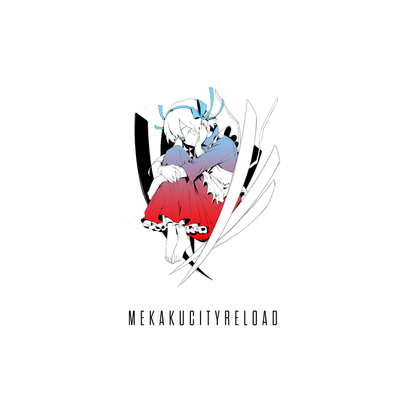
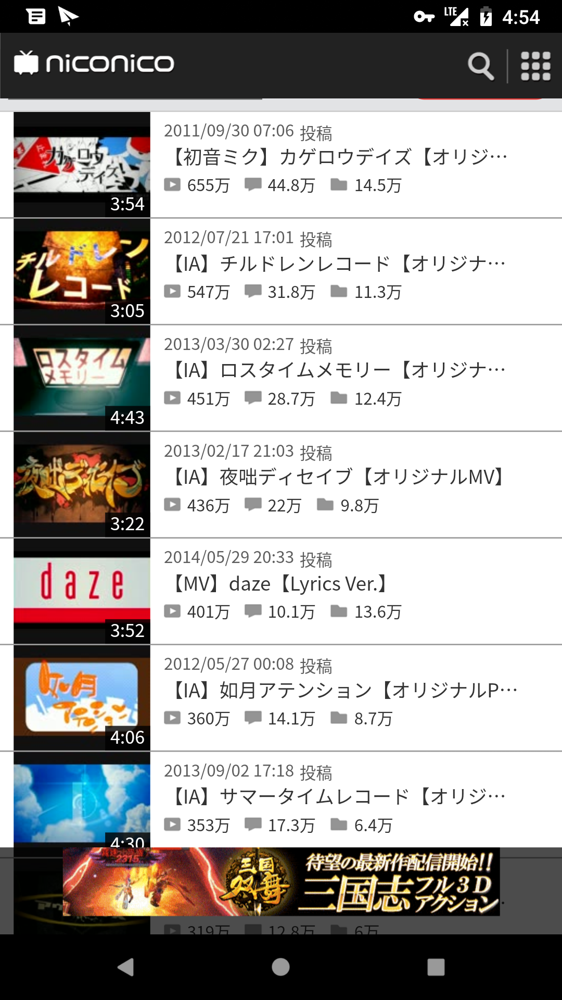
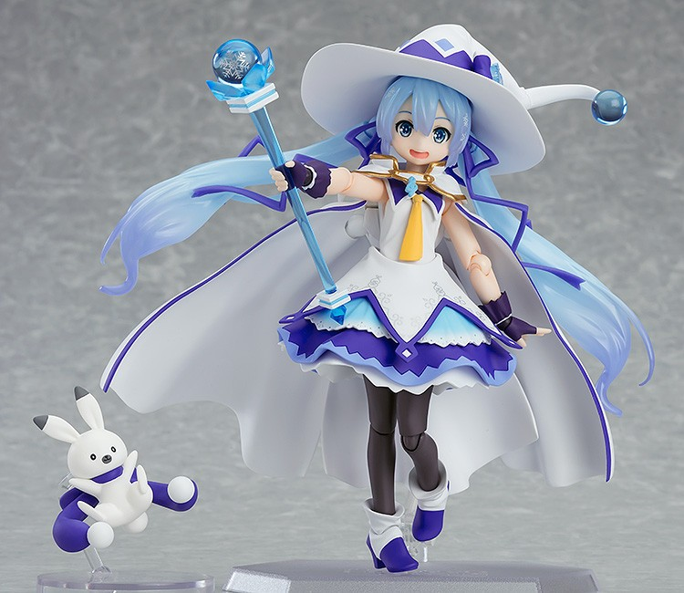
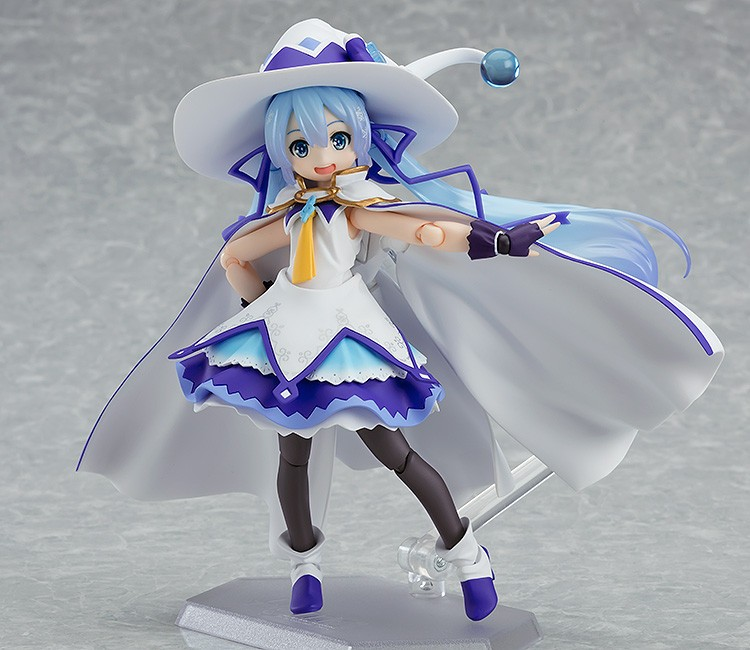

# 呼嘎，这里是李新朋。

## 平成年已经过去，那我就把平成年最后一次周刊讲了吧。

### 〘V榜〙

1. 【桜乃そら】一直表揚我的桜乃そら老師 【GYARI(ココアシガレットP)】 av39222542 （new！）
2. 【初音ミク】暴力扳机【八王子P】 av38847372
3. 【初音ミク】这首歌如果播放不过100万我就去死！【たまお】 av18905926
4. 【初音ミク】无论何时HappyDay！【バカッパの証】 av7148145
5. 【初音ミク】スチールワンダー【はるまきごはん】 （new！）
6. 【VY1&初音ミク】心灵・死亡【砂天狗】 av38525434
7. 【初音ミク&巡音ルカ】世末舞厅【wowaka】 av7527
8. 【初音ミク】发条少女时钟【Drop】 av37788594
9. 【鏡音リン】ROKI【みきとP】 av20149916
10. 【初音ミク】Last Dance【Eve】 av38145487
11. 【初音ミク】Dance Robot Dance【ナユタン星人】 av7411554
12. 【初音ミク】砂之行星【ハチ】【魔法未来2017主题曲】 av12428430
13. 【紲星あかり】Akari来了哦【GYARI（ココアシガレットP）】 av32209798
14. 【鏡音リン】愛的容器【みきとP】 av39374073 （new！）
15. 【初音ミク&鏡音レン】Crazy・Beat【さつき が てんこもり】 av38065639
16. 【初音ミク】绿光·小夜曲【Omoi】【2018魔法未来主题曲】 av26278906
17. 【歌愛ユキ】浮遊月光街【稲葉曇】 av38760155
18. 【GUMI】马赛克卷【DECO\*27】 av6397355
19. 【鏡音リン】钝色痛感【ツミキ】 av39322047 （new！）
20. 【鏡音リン&鏡音レン】劣等上等【ギガ】【魔法未来2018 / 鏡音レン・リン 10th周年主题曲】 av26776777
21. 【初音ミク】I love U【ううめ】 av12044093
22. 【初音ミク】幽灵法则【DECO27】 av3540151
23. 【初音ミク】碱性劣等生【かいりきベア】 av7248840
24. 【flower】Charles【バルーン】 av6648468
25. 【初音ミク】明星银河号【ナユタン星人】 av19825128
26. 【初音ミク】Alien Alien【ナユタン星人】 av4285714
27. 【IA】明日的夜空哨戒班【Orangestar】 av1437042
28. 【初音ミク】火花【DECO27】 av12965661
29. 【IA】六兆年と一夜物語【kemu】 av246099
30. 【鏡音レン】拼图游戏【まふまふ】 av37076516

**g鸽nb，新曲能一下子打掉如日中天的megumegu，之前八王子p是传说无望，现在还要加入冠军无望了。**

新的一年，要从用作开始，本次有不少工作曲，六兆年的炸尸或是世末舞厅的还剩200万的神话冲刺，都一直显露着一股工作气息。

***

今日强推，春卷饭新曲，米奇头新曲。

那我们就开始：今天的话题，阳炎，在去年的这个周里，阳炎的创作者jin，创作了第三张阳炎专辑，时隔五年重新开始阳炎乐章。



我在之前看过几张图，是说这些vocaloid歌姬最伤他们感情的一句话是什么。


看到IA了吗，这就和jin息息相关了（你是魔鬼吗，IA这么可爱）

JIN、自然之敌P最一开始选择使用的Vocaloid为初音未来

让自然之敌P声名大噪的作品──「カゲロウデイズ」，就是使用初音所演唱的

而这首作品让即将推出新V3歌手 IA 的1st公司注意到

并与自然之敌P签下合约，自然之敌P隶属于1st公司之下

自此之后自然之敌P的歌曲主要都以IA所演唱，算是一种帮IA宣传的手法，你想这次g鸽新曲就是帮忙宣传的结果，虽然我对此并不喜欢，甚至有些讨厌。

然而这次三专，专辑中一首IA的曲子都没有全是初音唱的，IA酱哭了。

这并非是阳炎在vocaloid界不受欢迎的主要原因，其实主要原因是罢榜。

看看这些播放量吧：



这些曲子都在2013年充斥着vocaloid的榜单，jin以一首「アヤノの幸福理论」


只花费4小时11分钟的速度刷新殿堂纪录（现在被超了，那个曲子不想也知道是哪首）(编者注: **砂の惑星**, 典型的工作曲, 如果不工作说实话也就20w)

阳炎系列在Vocaloid的再生数字表现上，可以说十分亮眼

但这也是阳炎于Vocaloid界遭受讨厌的原因

阳炎的再生速度与其说人气高的象徵，倒不如说是被工作出来的象徵

JIN再怎麽说好歹也是有一定水准的

但拿非阳炎曲的作品拨放数跟阳炎曲相比

便可以知道什麽是正常的数字甚麽是不正常的数字了

「如月アテンション」，2012/05/27 00:08上传，并仅花费一天多的时间打败早在24号就上传的「アイロニ」，获得Vocaloid週刊#243第一名

「ロスタイムメモリー」，2013/03/30 02:27上传，并在距离週刊计算截止的4月1号这段时间内，获得了高达**两百二十万分**成为Vocaloid週刊#287第一名

阳炎的曲子经常能在短时间内获取大量的再生数，并且在全盛期时只要一有新曲就会跟著把该系列其他旧曲占满週刊的版面

再加上当时1st公司的大力宣传，包括小说，动画，一整套宣传，获得无数阳炎痴，导致当时周刊只剩jin与他的阳炎project。

而且jin只要不是关于阳炎曲子，就没有如此爆炸的播放数，就可以看见当时有多少阳炎痴了。

之后就爆发了ジエンド事件。

知名VOCALOID音乐家 オワタP 与动画师 三重の人 合作的最新原创曲「ジエンド（自演）」引发争议，动画中出现的文字隐射商业公司，掀起网路一片讨论。

「ジエンド」引发诸多效应，最终导致业界公司插手厘清。乐曲在今日达成点阅数十万、登上VOCALOID殿堂，作者オワタP则希望大家多加关注音乐本身。

「ジエンド（自演）」为VOCALOID音乐家 オワタP 的作品，最初是写给 1/9 发行的商业合辑《V♥25 -Exclamation-》的猜谜活动歌曲：不公布作曲人姓名，请听众猜猜看歌曲的作者是哪一位Ｐ。当时的猜谜ＰＶ掩盖著马赛克，让人疑惑底下的字句究竟有何玄机。

然而里面的pv发布之后，里面充斥着，刻意掩盖的某家公司，某位p主。

ＰＶ最后则写著：「这个动画所登场的团体名、事情皆为虚构，与实际的事实无关联。只不过是巧合而已喔（笑）」不过在同一画面的后方，却以透明的文字写著「这个故事是根据真实事件所构成。」


最后，这首曲子自然是引起了jin与1st的关注,

オワタP是这样说的，

关於「ジエンド」动画，

1/29 晚间，和「1st PLACE」的村上社长直接会面。向社长传达这个动画内的情报，是根据间接的、或直接关系到各创作者的事件所制作而出。

以此为前提，关於这个动画内提到 1st PLACE 公司的部分，以 1st PLACE 的角度见解而言，表示情报有著和事实相异的部分，并有引用一部份事实、但和真实内容不同的部分。判明出动画包含著不明了事实的内容。

双方交换意见的结果，在双方情报共通的现时点，帮助调查各个情报来源的可信度，并拜访关系者将问题探究明白。

这次让各个创作者、关系者、以及观赏这个动画的各位感到不快真的非常抱歉。

1st PLACE 和我将共同协力，向各位报告此事将持续调查。

这次也是第一次，公司介入p主斗争之中，最后オワタP公开道歉删除投稿，三重也消失与人们视野之中。

「ジエンド」歌曲事件至此似乎告一段落。然而动画之中提出的内容、以及讨论串所引发的诸多探讨则值得省思，创作者或听众该如何把持初心和理念，该如何面对网路世界的舆论，演变为重要的议题。同时揭示如今日本的 VOCALOID 音乐圈，确实和过往不同了。

从这开始vocaloid界出现了，真正意义上的商业化狂潮，搞个系列曲，人设最好请大手来，作个精美的PV

曲子速度给他快有中毒性，角色故事中二可BG可百合最好来个BL

原创角色系列曲与Vocaloid的连结也就仅仅剩下了原唱为Vocaloid

然而这对于因为喜欢这原创角色系列曲的粉丝而言

主唱是谁真的不是什麽重点，

这样的状况使得当时的Vocaloid陷入了新的粉丝仅对系列有爱

却气走了那些早期喜欢初音的粉丝

当系列曲结束，新的粉丝转移视线离开Vocaloid

那些消失的粉丝也很难再回来。

你像honeyworks，几乎很多人都是喜欢的honeyworks的情节，又有多少人知道，其实所有的曲子都是vocaloid做的呢？

当他们之后吧vocaloid换成唱见时，甚至没有人发现，粉丝竟然一点异样都没有察觉。

所以当honeyworks人气都大，便像现在这样抛开vocaloid,带领自己粉丝去关注自己的番或是小说漫画，留下的却是vocaloid的一大片空白

所以才出现了2014与2015年的衰退期，两年内，只有nbuna与orangestar能带动一些人气，2015年甚至周榜冠军是小林阿姨和小林阿姨音源的合唱脑浆炸裂阿姨。

在2016年之后，在deco又来救场之后，日v终于开始展现会暖的局势，在八爷与ryo访谈里认为现在vocaloid就是被荒废的沙漠”，但水母p却并非这样想，他在访谈里讲，

为了让“被荒废的沙漠”有说服力，对这4年间视而不见，“在此期间努力的人又怎么想呢？且不说我自己，把ナユタン星人、バルーン、n-buna、Orangestar等这些近年来支撑着ボカロ界的人们说成沙？2014年时只在圈内流传的ボカロ衰退论被圈外人知道了，所以我担心会让很多人产生“ボカロ过时了”的印象。

下2014年正是真正意义上的转型期，从一开始的商业化的狂潮中冷静下来，回归之前，只是单单听曲子的感觉。

阳炎有什么错？阳炎只不过是被躺枪而已，我的手机里还有阳炎从第一张到第三张全部专辑的曲子，所以说错不在阳炎，只是vocaloid永远都要面临的最大问题：商业化

ryo与kz的商业化、游戏DIVA系列的推出让我们看见商业化的优点

自然之敌P与1st的阳炎企划让我们察觉到商业化的危机。

就像八爷在访谈里说的一样，以后一定要出现大家都说八爷是谁呀的场面才行呀。

因为有バ儿ーンさん、ナユタン星人、n-bunaくん这样新世代的人出现了，所以想要那些人也能多加油。接著受到这些孩子的影响，就会有更多年轻孩子出现⋯⋯真希望能够一直这样下去呢。

因为多元所以致胜，千篇一律的商业化，并非vocoloid所拥有的优势。

miku不能伴我们一生，总有一天，她会衰退，虽然16年的复兴期，让我们看到并非像想象的那么近，但总有一天，miku会停产，但在那之前，我们只要开开心心听歌，有些触动人心弦的就保存，这就够了。

```
在这又唱又跳的happy birthday中
我们约束到沙漠之中种植苹果树
之后我们翻完跟斗地说再见
接着轮到谁就麻烦你尽情发挥吧
```

***

## 下面是资讯

#### miku雪初音手办一如既往在今年夏天7月发售，而且这次你确定是16岁？






#### 距离巡音投稿还有26天


巡音ルカ10周年纪念网站
https://piapro.net/luka10th/

#### 各种新出炉の传说曲:

1. mafumafu的贞德曲（compass角色曲）历时546.8天传说


2. 尤里卡农的自杀游行历时528.8天传说


3. 奶油糖星人的银河明星号历时311.6天传说


#### 这次nhk红白歌会开幕是由DAOKO和miku一起演出的哦


