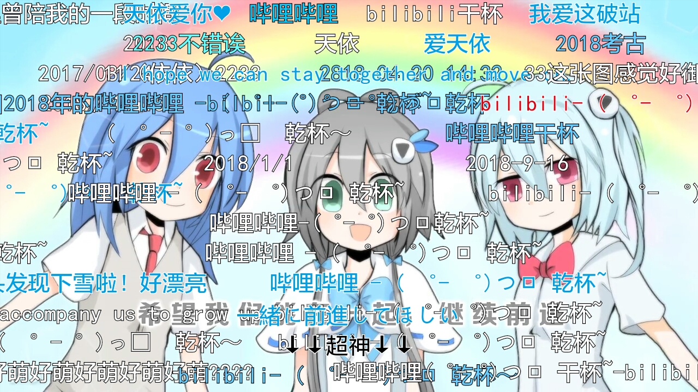

> Time: `2019-01-01 15:34`

# ***华风夏韵，洛水天依***

啊，我回来了。~~咕咕的一周已经过去~~，先祝大家新年快乐，身体健康，学业有成！

好了，来开始咱们的曲推。今年要说的是之前的承诺，**洛天依**的

# ***CONNECT\~心的连接\~***

传送门: [av1231151](https://www.bilibili.com/video/av1231151/)

## 首先是主创：

| Staff | Name |
| ----- | ---- |
| 作编曲/调教/PV | 阿良良木健 |
| 作词 | 苍十三 |
| 曲绘 | 历历路路 |

## 再来是歌词：

有我在陪着你 有我在爱着你
 
有我在听着你 想诉说的话语
 
天地辽阔神奇 你却总是叹息
 
梦想与现实的距离

你身边的美丽 你却总不在意
 
你永远在找寻 被遗忘的回忆
 
放下烦恼思绪 跟着我的旋律
 
一起前进 不离不弃

还没有看到胜利
 
何必就让自己出局
 
就算前路崎岖 布满了荆棘
 
还有我和你在一起

欢呼着bilibili 次元咒语
 
解开你心中的谜题
 
找寻自己 存在的目的
 
再次相信你就是唯一

歌唱着bilibili 跟我一起
 
探寻这美丽的天地
 
别让自己的心灵紧闭
 
你抬头望去
 
会看见彩虹在 天际

还没有看到光明
 
何必就将希望抛弃
 
连接你的心 让世界倾听
 
你心中最美的声音

欢呼着bilibili 能量咒语
 
别让你的梦想停息
 
勇敢的心 勾绘着梦境
 
现在追就不要再犹豫

歌唱着bilibili 跟我一起
 
寻找身边爱与惊喜
 
时光将种子埋在这里
 
来等待花期 绽放你的奇迹

呼唤着bilibili 次元咒语
 
解开你心中的谜题
 
找寻自己 存在的目的
 
再次相信你就是唯一

歌唱着bilibili 跟我一起
 
找寻这美丽的天地
 
别让自己的心灵紧闭
 
你抬头望去
 
会看见彩虹在天际

***

新年第一推啊（笑），说一说这首曲子也不错。首先呢，这是阿良良木健为b站五周年庆典献上的礼物，同时也在各大演唱会登场，享有很高的声誉。有相当数量的人把这首曲子当做~~战~~站歌来听，弹幕中出现的最多的就是*哔哩哔哩( ゜- ゜)つロ干杯-～BILIBILI*。清新的PV和正能量的歌词，得到了网友们的一致好评。殿堂曲。大家要注意一下这个主创团队，阿良良木健，历历路路，苍十三。非常著名的组合，以《末日disco》《明日disco》《I LOVE U》为最初的知名曲等作品为大家所喜欢。曲风统一清新明快，~~直到出现了春风来~~富有动感，颇具特色的创作团队。~~不过阿良貌似只会调天依~~这仨以后我还会说的。差不多就是这样了。最后放一张图

新年新气象，我打算开个新坑。~~一个填不满的坑~~之前，有些人对于中v的调教发表了很好的看法，我深有体会，决定找一找那些中v的神调教和大家分享。以后仍是不定期更新，这个坑不知道要填多长时间了。。。首先是第一首曲子：

星火行动第一弹的作品，也是踏云社某专辑的收录曲。 
制作宏大，场面惊人， 
出神入化的调教让很多人看到了调教的艺术。 
也让调教者收获了“爸爸”的头衔 
要说的差不多就是这样了，我们下一更再见👋

# *我要让这次元，染上我的颜色！*
